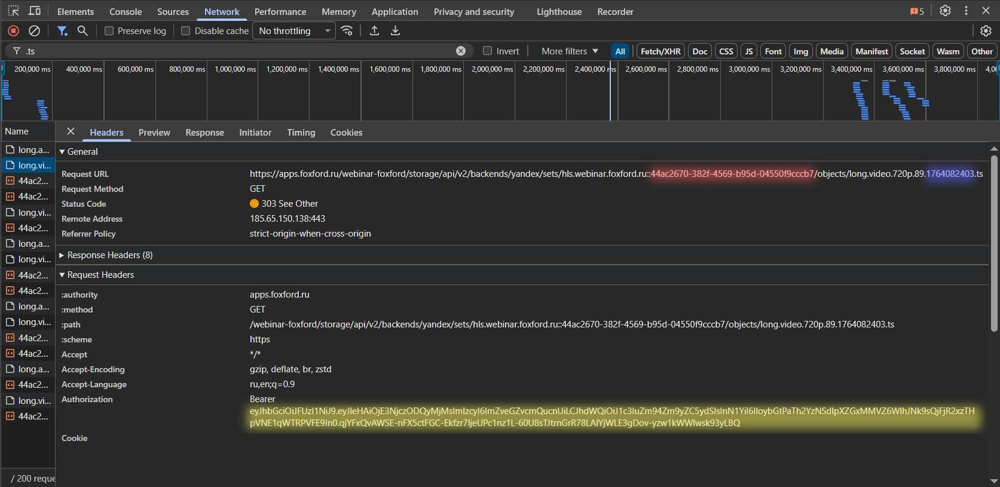

## Скрипт для загрузки вебинаров foxford

### Дополнительные компоненты

Обязательные к установке компоненты:
1. [Python 3](https://www.python.org/)
2. [библиотека requests](https://pypi.org/project/requests/)
3. [ffmpeg](https://ffmpeg.org/)

Дополнительные компоненты:
1. [библиотека colorama](https://pypi.org/project/colorama/)
2. [библиотека playsound](https://pypi.org/project/playsound/)

### Инструкция по использованию

1. Открыть в консоли директорию программы.
2. Запустить main.py через python (`py main.py`)

Для работы нужны данные, которые вы сможете получить со страницы вебинара. Двое, `lesson` и `pstfix` нужны единоразово, `Bearer` нужен каждые ~30 мин.
Чтобы их получить, нужно открыть инструменты разработчика и перейти на вкладку Network. В поиск ввести `.ts`.
Открываем любой запрос с кодом 303.

- 
- Красный - `lesson`
- Синий - `pstfix`
- Жёлтый - `Bearer`.

Когда программа запросит новый `Bearer` (сопровождается звуковым сигналом), нужно перемотать куда-нибудь запись трансляции и открыть свежий запрос. Отсюда и копируем новый `Bearer`.

Когда запросит `Bat autostart? [y/n]`, вводите `y`.

Открываете папку по имени [`lesson`],которая появилась в корне. Просматриваете _output.mp4 на наличие глюков. Если они присутствуют, повторяете процедуру заново.

>Внимание! Для снижения риска возникновения глюков, на время скачивания рекомендуется иметь стабильное интернет-соединение без сильной нагрузки на сеть. 

### Аргументы командной строки

1. первый позиционный - `lesson`
2. второй позиционный - `pstfix`

Флаги:
 - `--del_all` (`-d`) - по окончании процесса удалить все файлы кроме финального видео
 - `--save` (`-s`) - не обновлять уже существующие фрагменты в директории
 - `--name [name]` (`-n [name]`) - задать название выходного каталога
 - `--nosound` - не издавать звук при запросе нового `Bearer`
